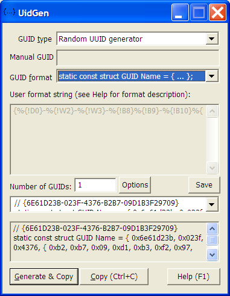
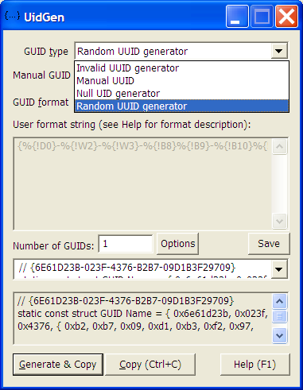
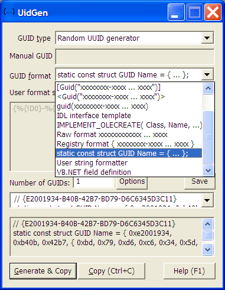
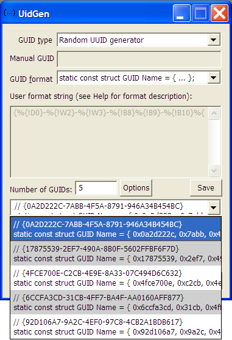
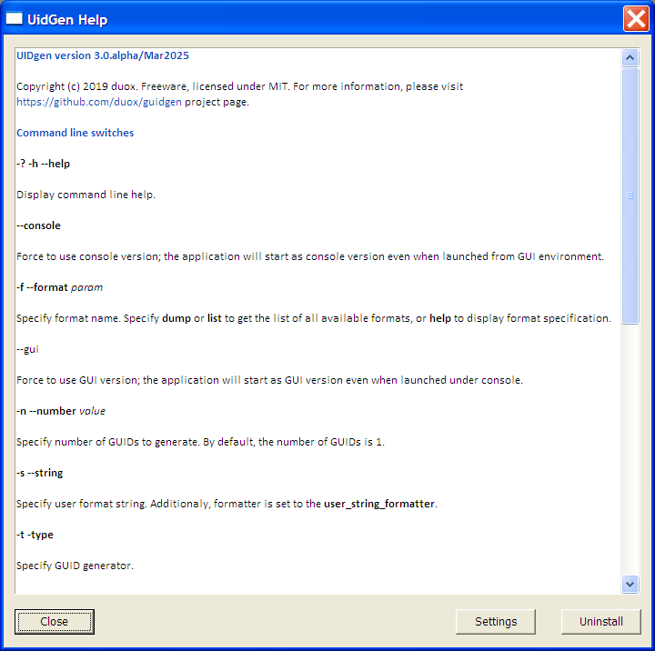
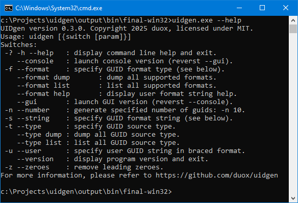

UIDgen - UUID generator, GUI and console versions.
========================================================

Author: [https://github.com/duox](https://github.com/duox)  
Project page: [https://github.com/duox/uidgen](https://github.com/duox/uidgen/)  
License: MIT 
Supported platforms: Windows only

UIDgen is a small utility that extends functionality of the standard WinWDK uidgen utility.
Besides of the standard functionality of the UUID generation, following features are implemented:
- both GUI and console versions selected automatically or manualy on startup;
- extended number of UUID formatters;
- user-supplied format string that allows any kind of UUID formats;
- support for generator and formatter plugins (./sdk/ folder);
- allows re-formatting of user supplied UUID (manual generator);
- multiple UUIDs can be generated and copied to clipboard or saved to a file;
- configurable behaviour (related to the UUID generation and main window behaviour);
- the Windows version uses only standard Windows DLLs, while the standard MSVS/SDK uidgen.exe uses MFC dll;
- global key hook that allows for background UUID(s) generation;
- resizeable dialog windows allow for better user experience.

Contents
-----------------

[Screenshots](#Screenshots)  
[UID generators](./docs/generators.md)  
[UID formatters](./docs/formatters.md)  
[Plugin interface](./docs/plugins.md)  
[Use in MSVS](./docs/use-msvs.md)  
[Alternatives](./docs/alternatives.md)  

Screenshots
-----------------

* Default window state: 

* List of available UUID generators: 

* List of available UUID formats: 

* Drop box with results: 

* Internal help: 

* Command line utility help: 

